# Store

"Store" is a cross-platform application created as an open-source.

For both Android and iOS, We've included an app icon that you can see in the home page and when you view all the pages opened on the simulators. The logo in the icon was created by myself, with some colors that elevate the design.

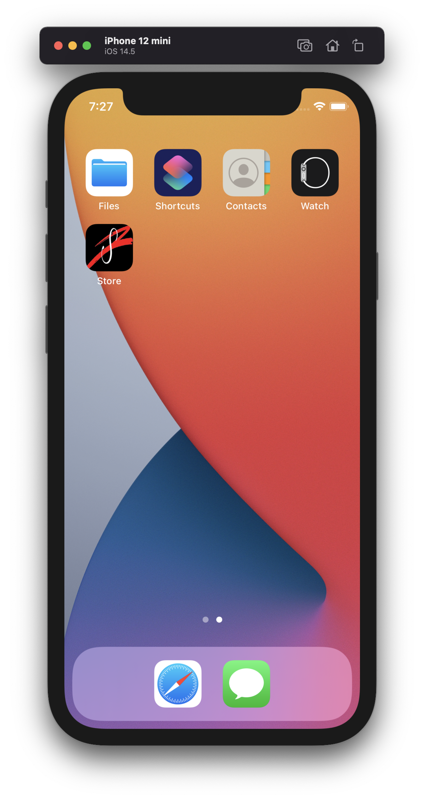 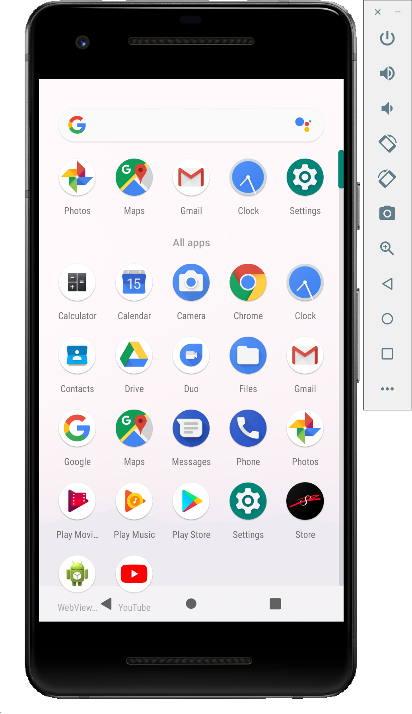 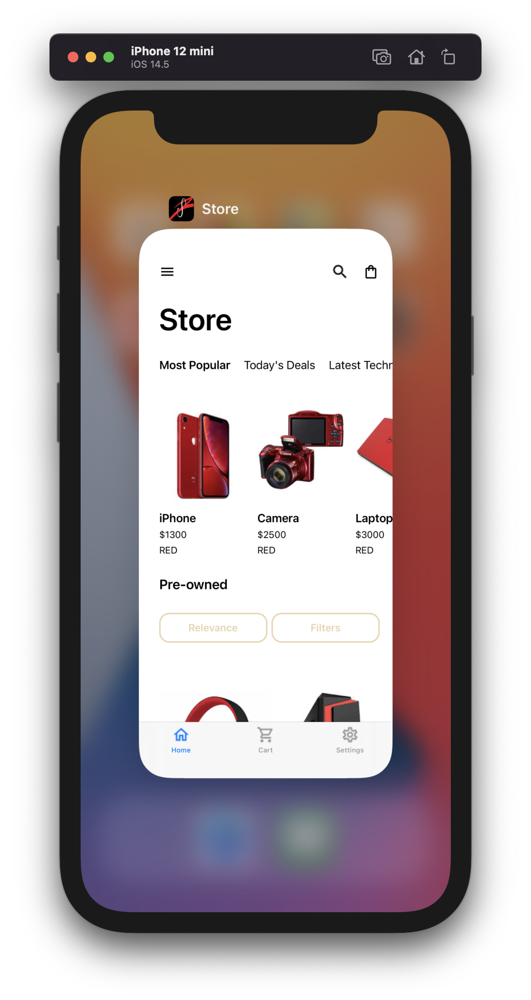 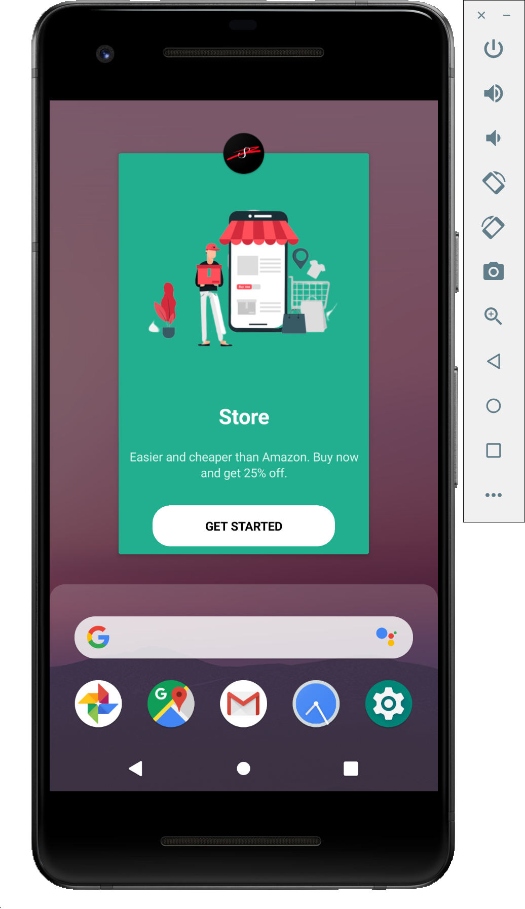

When you first open the app you will see the splash screen, that was created with the same logo as the icon. This screen was created with the purpose to give the users something to see and a way to confirm that they opened the "Store" app.

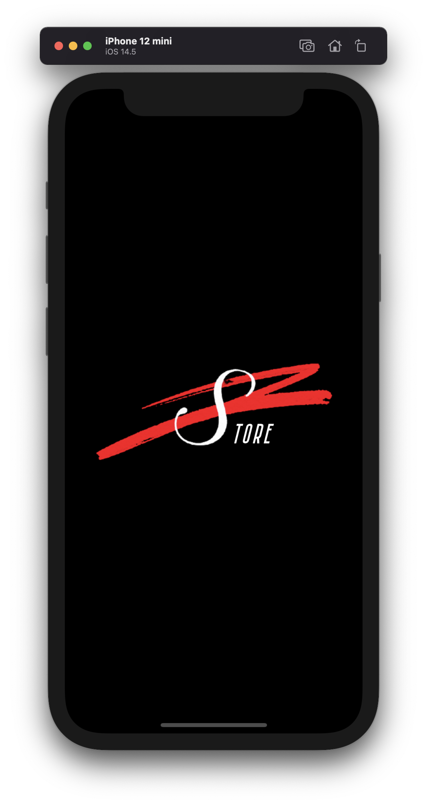 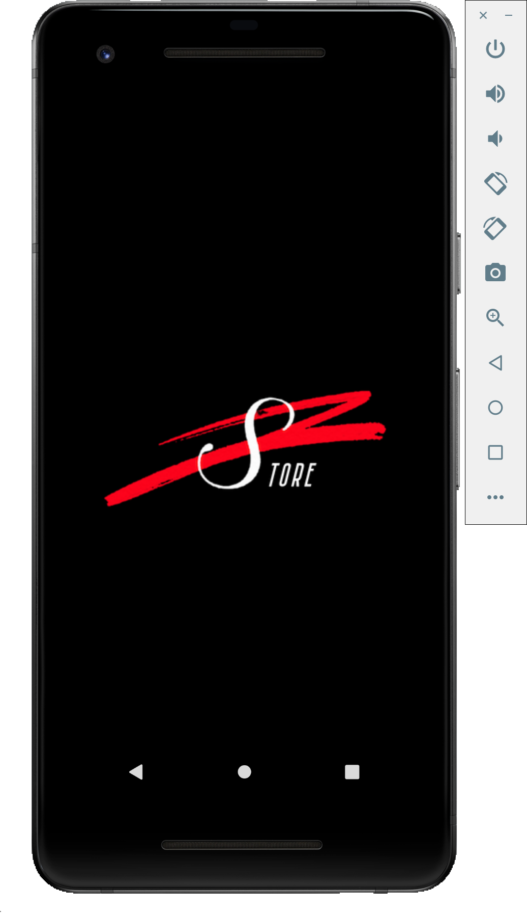

Once the app has been loaded you will automatically be directed to the Onboarding page. On this page you will see an eyecatching special that will draw the user in, 90% of the time leading to a purchase. At the bottom of the screen you can see the "Get Started" button which will navigate you to the Home page.

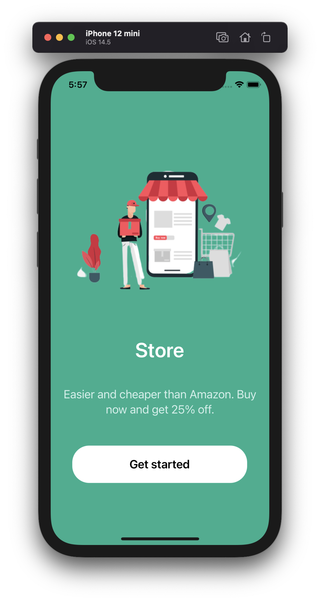 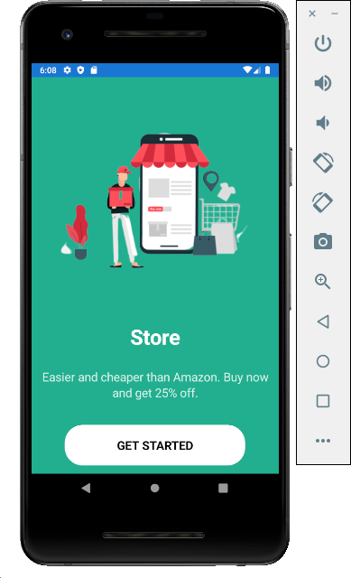

On the Home page you will see the name of the store in bold and on the top left. At the top of the page you will also see the menu icon, search icon, and the shopping bag icons. If you look slightly below the title you will be able to find 3 sections reading: "Most Popular", "Today's Deals", and "Latest Technology. In the Most Popular section you will see 3 of our sample items: an iPhone, a Camera, and a Laptop. Under the listed items you can see the price of each item, as well as, the color of each item. Keep in mind that this is a scrollable list. When you scroll down on the page you will see our "Pre-owned" items, which you can filter and sort by relevance, to find exactly what you're looking for. In this list you will be able to see our "Red PC", as well as our "Red Headphones". At the bottom of the page you will see three tab pages:"Home", "Cart", and "Settings". You can switch about these tabs, simply by clicking them, you'll be able to tell which tab you are on because the icon will turn blue.

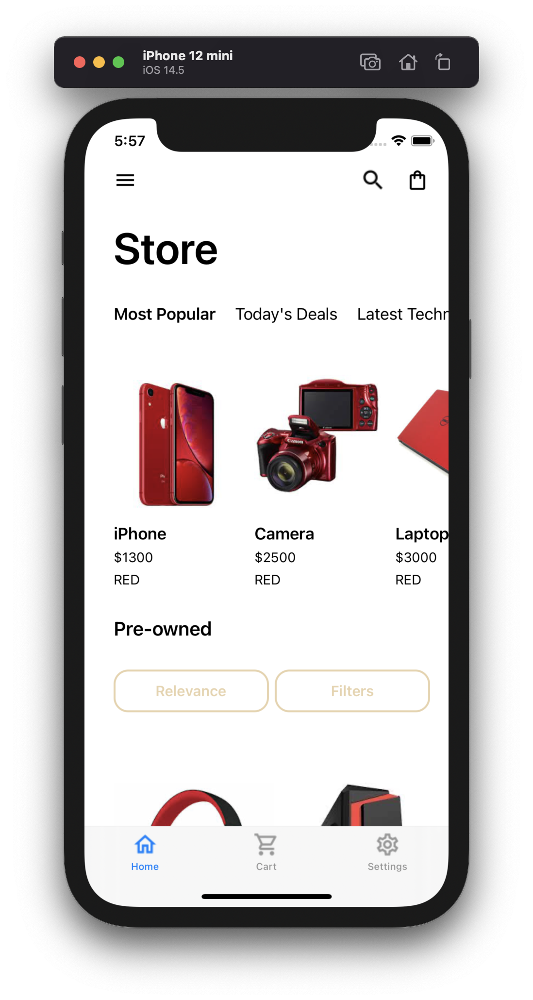 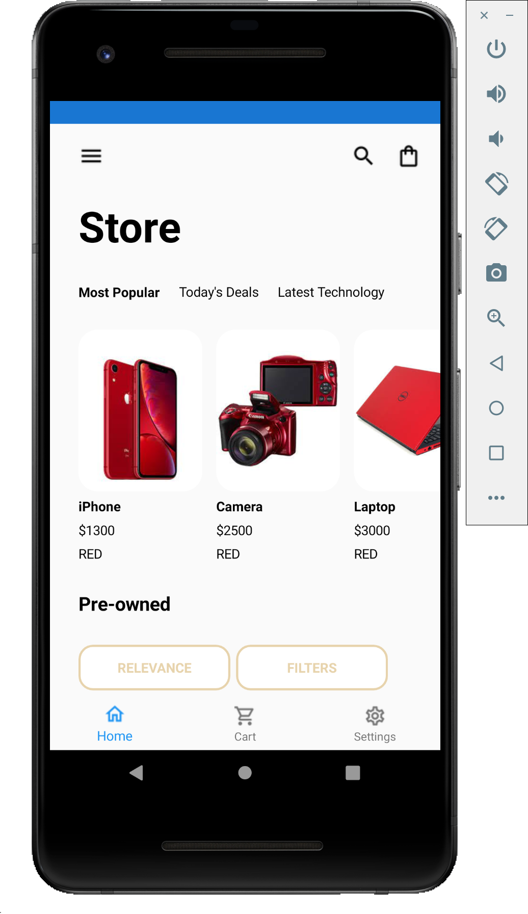

Now, when you click on an item you will be directed to the product detail page. On this page you will be able to see the item in a larger view, see the details of the item, add to your favorites, or if you're ready to buy you can add it directly to your cart. If you want to go back to the home page, all you have to do is click the back arrow in the top left and you'll be back. 

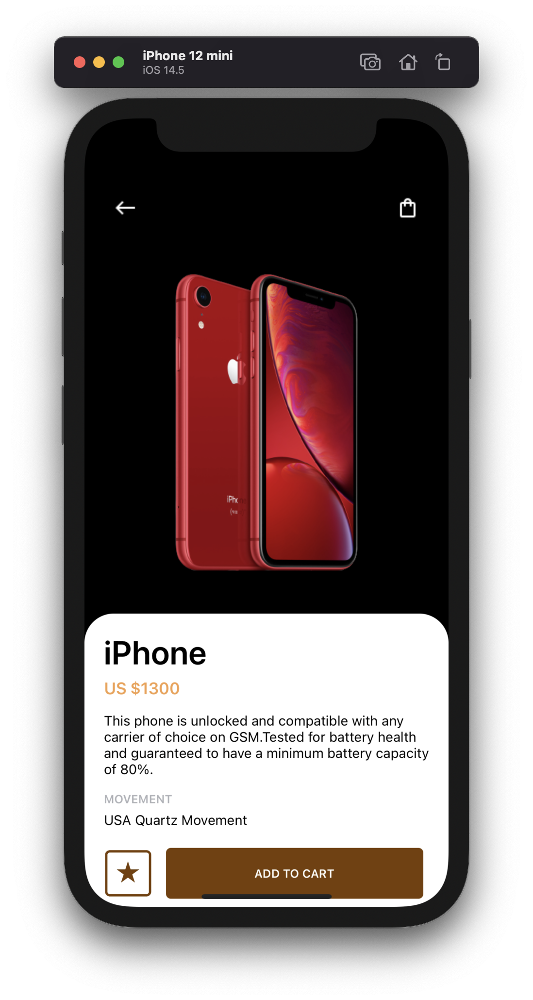 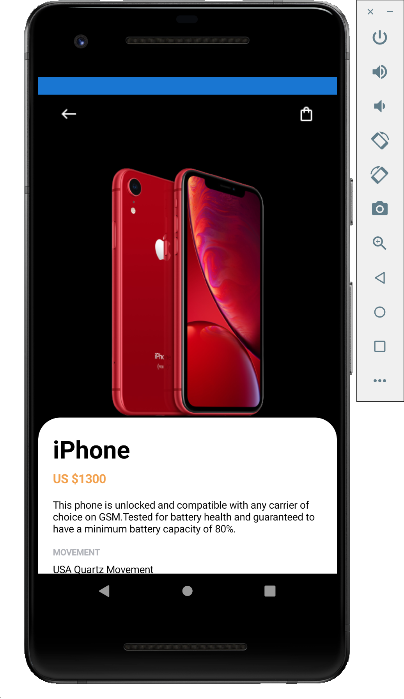
